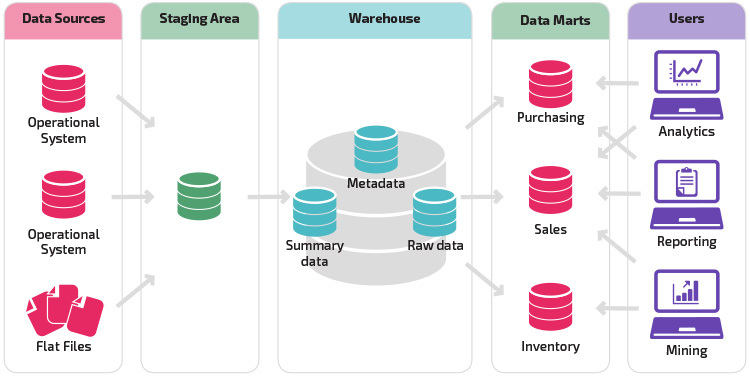

# Data Mart

* It is a subset of Data Warehouse. 
* Data Mart is created for specific purpose as per business needs.

### Reasons For Creating Data Mart:
* Easy access of frequent data.
* Improve End User response time.
* Less cost and easy to build.

