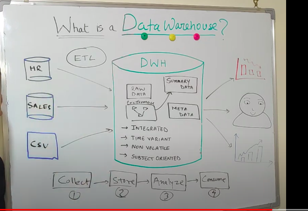

# OLTP

OLTP is Online Transaction Processing.
It is mainly the databases present in the source where all the transactions take place.

# OLAP

OLAP is online Analytical Processing.
OLAP is the Data Warehouse where all the analysis is done.

 

## OLTP Vs OLAP

|   OLTP    |   OLAP    |
|   ----    |   ----    |
|1. These are the databases, situated at the source end | 1. This is the target Data Warehouse|
|2. These are operational Databases.    | 2. These are for Information Processing. |
|3. It uses DDL and DML languages.  |3. It uses DRL/DQL language (SELECT). |
|4. It stores data on day to day basis. | 4. It stores historical data. |
|5. It uses short and standard query    | 5. It uses large and complex queries. |

 
 

