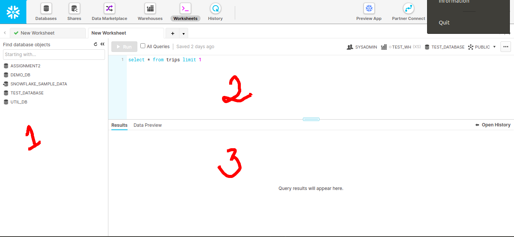
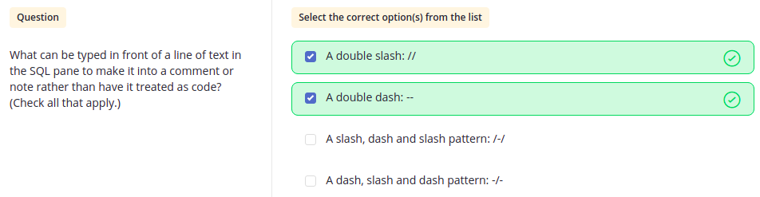
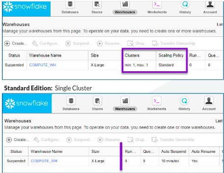
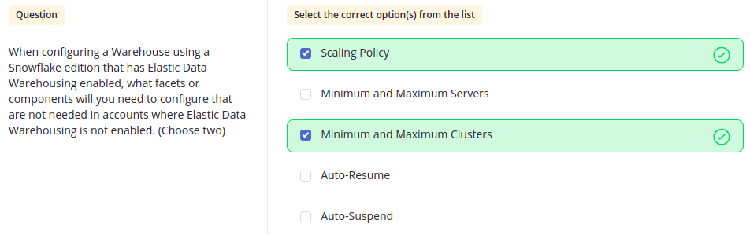
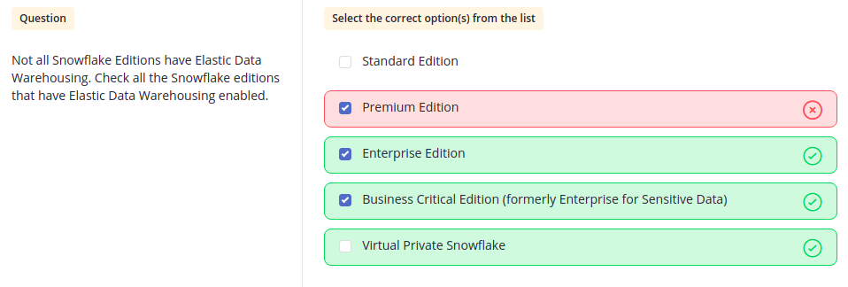
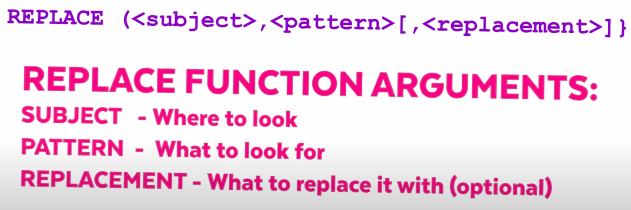
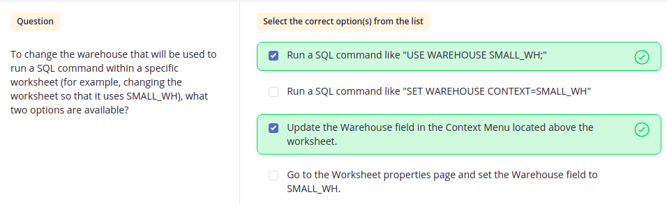
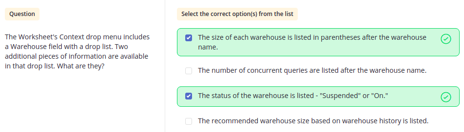
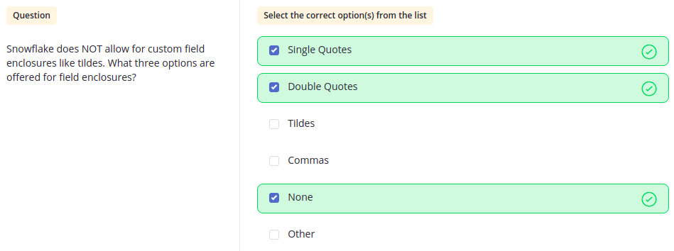
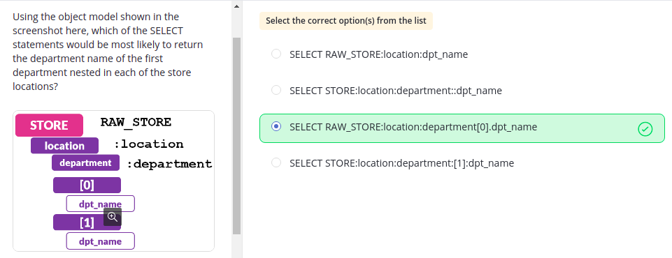

# Questions Based On Hands-On Essentials Data Warehousing

 

Q. What are the **ROLES** available in Snowflake?
    
    1. ACCOUNTADMIN  
    2. SYSADMIN  
    3. PUBLIC  
    4. SECURITYADMIN
    5. USERADMIN

---
 

Q. What is the DEFAULT ROLE selected when you log in to Snowflake?

    SYSADMIN

---
 

Q. Which default roles have access to the **ACCOUNT** option in the ribbon?

    1. ACCOUNTADMIN
    2. SECURITYADMIN

---
 

Q. Which default role has access to the **ACCOUNT** and **NOTIFICATION** ribbon(toolbar) options?

    ACCOUNTADMIN

---
 

Q. The old UI is called?

    The classic console

---
 

Q. Name the various sections.

    1. Navigation Tree
    2. SQL Entry Pane
    3. Result/Preview Pane

---
 

Q. Comments in Snowflake.

---
 

Q.

    ● If you have CLUSTER and SCALING POLICY then your Snowflake account is MULTI-Cluster and an ENTERPRISE EDITION.
    ● An Enterprise Edition also gives benefit of SCALING OUT i.e. ELASTIC DATA WAREHOUSING 
      in which WH will stretch for extra work and will come back to normal state after the work has been done.
    ● Elastic Data Warehousing has two additional components:

        ○ Multi-Cluster options (Min & Max cluster)
            Eg - Medium Size has 4 servers.
            (min,max) = (1,10) i.e. when min, use 1 cluster with 4 servers and when max, use 10 cluster with 40 servers.

           ● SCALE-OUT (automated) - Scaling a warehouse OUT will increase the number of servers & clusters. (e.g. Min to Max)
           ● SCALE-IN (automated) - Scaling a warehouse IN will decrease the number of clusters. (e.g. Max to Min)

        ○ Scaling Policy options

    ● If you don't have that then you have STANDARD EDITION.
       ● SCALE-UP (manual) - Scaling a warehouse UP will decrease the number of servers. (e.g. Small to Medium)
       ● SCALE-DOWN (manual) - Scaling a warehouse DOWN will decrease the number of servers. (e.g. Medium to Small)

---
 

Q. What is a **CONTEXT**?

    //Setting a CONTEXT

    USE ROLE SYSADMIN;
    USE WAREHOUSE COMPUTE_WH;
    USE DATABASE DEMO_DB;
    USE SCHEMA PUBLIC;

    //Displaying the context

    SELECT 
    CURRENT_ROLE(),
    CURRENT_WAREHOUSE(),
    CURRENT_DATABASE(),
    CURRENT_SCHEMA();

    //Display current account & region

    SELECT 
    CURRENT_ACCOUNT(),
    CURRENT_REGION();

    //Displaying all
    
    SHOW ROLES;
    SHOW WAREHOUSES;
    SHOW DATABASES;
    SHOW SCHEMAS;
    SHOW FUNCTIONS;
    SHOW PROCEDURES;
    SHOW USERS;
    SHOW TABLES;
    SHOW FILE FORMATS;
    SHOW STAGES;

---
 

Q. What are the **Data Types** for a column in Snowflake?

    ● STRING
    ● INTEGER
    ● TIMESTAMP
    ● DOUBLE
    ● NUMBER(precision, scale)
    ● VARCHAR(no. of characters)
    ● DATE
    ● FLOAT 
    ● VARIANT
    ● OBJECT
    ● ARRAY
    ● BOOLEAN

---
 

Q. What is **Replace** function in SQL?

    //Replaces "SQL" with "HTML":
    SELECT REPLACE('SQL Tutorial', 'SQL', 'HTML');

    //subject can also be a column_name.

---
 

Q. ELT vs ETL?

    ● ETL is Extract the data, Transform it and then load it.
    ● ELT is Extract the data, Load it as it is and then Transform it in Data Warehouse.

---
 

Q. What is a VIRTUAL WAREHOUSE in Snowflake?

    Virtual Warehouse is the compute power for the Snowflake.
    
    ● Warehouse power is used for loading data. 
    ● Warehouse power is used for unloading data. 
    ● Warehouse power is used for querying data.

    ● When you scale up a Virtual Warehouse i.e. from SMALL to MEDIUM,
      you are not increasing the cluster instead you are increasing the servers in that cluster.
      (You increase cluster in Enterprise Edition).

    ● When creating a warehouse, you choose a size. 
      The size of the warehouse you choose is the same as choosing the number of servers in the cluster.
    
    ● Available Sizes 
        ● X-SMALL
        ● SMALL
        ● MEDIUM
        ● LARGE
        ● X-LARGE
        ● 2X-LARGE
        ● 3X_LARGE
        ● 4X-LARGE

---
 

Q. What is a **STAGE**?

    ● "STAGES" or "STAGING AREA" are places to put things temporarily before moving them to a more stable location.  
    ● STAGES are more like cloud folders/directories where you place files so that snowflake services can pick them up
      and pull them into database structure quickly and securely.
    
    ● Snowflake has two types of stages:

        ● INTERNAL STAGES - acts like directories inside snowflake' local storage.
                            Types of Internal Stages:
                            1. USER - @~
                            2. TABLE - @%table_name
                            3. NAMED - @stage_name

        ● EXTERNAL STAGES - secure gateway between cloud storage services and snowflake services.
                          Eg - AWS S3 bucket, GCP bucket, Azure Blob

 

    //Creating and external stage

    CREATE STAGE MY_S3_BUCKET
    URL = 's3://load/files/'
    CREDENTIALS = (aws_key_id='1a2b3c' aws_secret_key='4x5y6z');

    //Listing files in stage area
    
    LIST @MY_S3_BUCKET/files;

    //Creating file format

    CREATE FILE FORMAT my_csv_format
    TYPE = csv
    FIELD_DELIMITER = '|'
    SKIP_HEADER = 1             --by default it is set to 0
    NULL_IF = ('NULL', 'null')
    EMPTY_FIELD_AS_NULL = true
    COMPRESSION = gzip;

    // Copy into table

    COPY INTO <table_name>
    FROM @MY_S3_BUCKET
    FILES = ('filename.txt')
    FILE_FORMAT = (FORMAT_NAME = my_csv_bucket)

---
 

Q. What is PURGE = TRUE in copy command?

    PURGE = TRUE | FALSE        --By default FALSE
    Boolean that specifies whether to remove the data files from the stage automatically after the data is loaded successfully.   

---
 

Q. What are sequences in Snowflake?

    ● Sequence is a counter that helps you keep track of what nos shoud come next for unique IDs.
 

    //Creating a sequence
    CREATE SEQUENCE seq_01 START = 1 INCREMENT = 1;     --default start and increment is 1.

    //Creating table with sequence
    CREATE TABLE <table_name> (id INTEGER DEFAULT seq01.nextval, name STRING)

    //Directly use in insert statment
    INSERT INTO <tablename> VALUES (seq01.nextval, 'Laura')

---
 

Q. Entity Relationship Model?

    ● ER model is a model where Entity is a Table, Attributes are Column Headings and Values are Row Contents.

    ● For JSON, Attribute is KEY and rest is same. It uses KEY:VALUE pair i.e. column:row_content pair. 

---
 

Q. What are the **Semi-Structure**d data format supported by Snowflake?

    1. JSON
    2. XML
    3. PARQUET
    4. AVRO
    5. Apache ORC

    ● They all use VARIANT data type

    ● For ignoring header for a semi structure data (XML) set STRIP_OUTER_ELEMENT = TRUE in create file_format command.
    ● For ignoring header for a semi structure data (JSON) set STRIP_OUTER_ARRAY = TRUE in create file_format command.

---
 

Q. What is FLATTEN keyword in Snowflake

    ● The FLATTEN command will parse nested objects into separate rows. 
    ● One version of the FLATTEN command uses a join (LATERAL) and the other uses an object (TABLE) keyword.

    ● Eg - 
        SELECT value:first_name
        FROM NESTED_INGEST_JSON
        ,LATERAL FLATTEN(input => RAW_NESTED_BOOK:authors); --authors have nested JSON for first_name and last_name
        
        SELECT value:last_name
        FROM NESTED_INGEST_JSON
        ,table(flatten(RAW_NESTED_BOOK:authors)); 

Eg - NESTED JSON

---
 

Q. **UPPER** function in Snowflake.

    SELECT UPPER('select current_warehouse();');

---
 

NOTE:
- Snowflake automatically converts unquoted, case-insensitive identifiers to uppercase internally, so an unquoted object name appears in upper case.