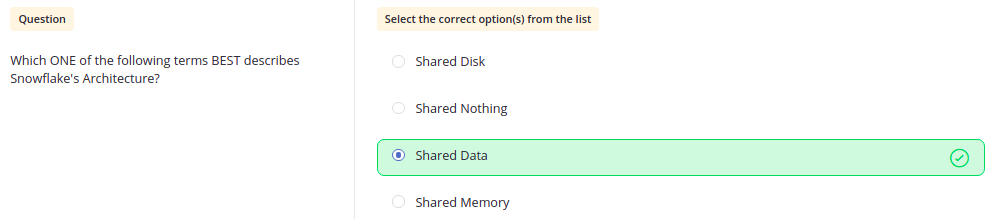
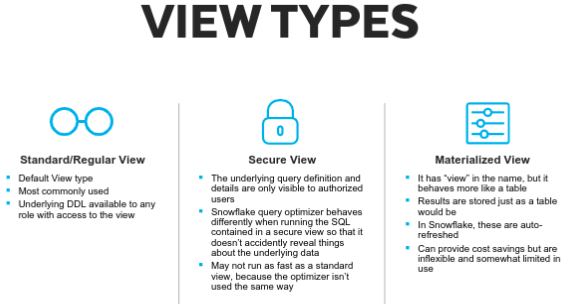

 # Questions Based On Leve Up First Concepts

 

Q.  Which cloud providers are supported on Snowflake Data Platform?

    ● AWS (Amazon Web Services) (S3 bucket)
    ● Azure (Microsoft Azure) (Blob)
    ● GCP (Google Cloud Platform) (GCP Bucket)

---
 

Q. What are the four layers of Snowflake Architecture?

    ● Centralized Storage
    ● Multi-Cluster Compute 
    ● Cloud Services
    ● Cloud Agnostic Layer

---
 

Q. What are the names of Snowflake's founders?

    ● Thierry &
    ● Benoit

`They were initially trying to "Re-Architect data storage, in the cloud, from scratch".`

---
 

Q. According to founders, Snowflake architecture supports?

`MCQ`

---
 
 
 

## Q. Architecture of Snowflake.

    3. Layer 3:
        ● Cloud Service Layer
        ● Service Layer
        ● Query Planning
        ● Query Optimization
        ● Query Compilation
        ● Metadata Management
        ● User Authentication
        ● Metadata Storage
        ● Data Security

    2. Layer 2: 
        ● Compute Layer
        ● Virtual Warehouse Layer
        ● Query Processing Layer

    1. Layer 1:
        ● Data Layer
        ● Storage Layer
        ● Centralizeed Data Storage

---
 
 
 

## Q. KEY Concepts of Snowflake.

    ● Snowflake is a true SaaS(Software as a Service) solution as it requires:
        ◉ No hardware to purchase or configure.
        ◉ No maintenance upgrades or patches to install.
        ◉ Transparent releases don't require user intervention.

    ● Installment options of Snowflake
        Snowflake-Hosted Accounts (on Amazon cloud infrastructure)
        Snowflake-Hosted Accounts (on Azure cloud infrastructure)

---
 
 

## Q. Snowflake Ecosystem.

---
 

## Accounts & Assurances

Q. Snowflake Industry Compliance Award

---
 

Q. Snowflake Editions

    ● Standard Edition
    ● Enterprise Edition
    ● Business Critical Edition
    ● Virtual Private Snowflake (VPS)

---
 

Q. When setting up a Snowflake Account

---
 

## Container Hierarchy

Q. Storage Hierarchy 

---
 

Q. Schema Objects

---
 

Q. Table Types

---
 

Q. View Types

---
 

Q. Stage Types

---
 

Q. Shared Databases

---
 
 

## Backup and Recovery

Q. What is Time Travel?

    ● Accessing historical data at any point within a defined period.
    ● Each typeof table has time travel period.
    ● You can undrop a table if it is missing within a time travel period.
    ● If the file is missing which is not within the time period then you can make use of fail-safe support and contact Snowflake for the same.
    ● If you delete a row then Clone table from a previous point in time using time travel.

