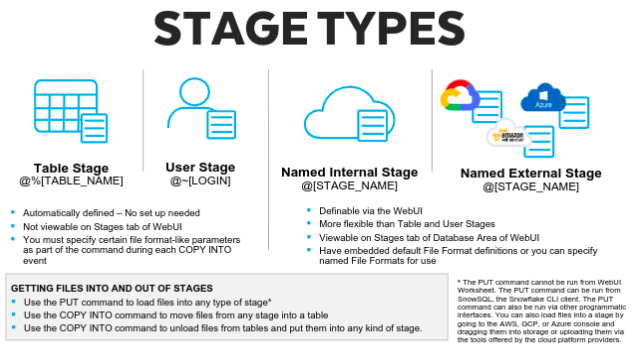

# Architecture of Snowflake

### What is Snowflake?

- Snowflake is a pure **SaaS**(Software AS A Service).
- It is a Data Warehouse that runs on cloud.
- Available on AWS, Azure, GCP.
- Stores data in **_columnar_** format.
- Works well with semi-structured data like **JSON, XML, AVRO, Apache ORC, Parque**t.
- Separate data type for storing semi-structure data i.e. **VARIANT**.

### Architecture

- **Shared Disk Architecture** uses multiple nodes to access data stored on a single storage system.
- In **Shared Nothing Architecture** all nodes have soul access to distinct storage system.

 

_**Snowflake Architecture**_

- Snowflake is a hybrid of shared disk and shared nothing architecture.
- Like Shared Disk 
    - It has central data repository i.e. accessible to all compute nodes.
    - This provides simplicity like Shared Disk Architecture
      
- Like Shard Nothing
    - Each node or VW(Virtual Warehouse) stores data locally.
    - This provides Massive Parallel Processing (MPP), performance, and scalability like Shared Nothing Architecture.

---

### What is Virtual Warehouse?

Virtual Warehouse is the compute power for the Snowflake.

- Warehouse power is used for loading data.
- Warehouse power is used for unloading data.
- Warehouse power is used for querying data.

Available Sizes
- X-SMALL
- SMALL
- MEDIUM
- LARGE
- X-LARGE
- 2X-LARGE
- 3X_LARGE
- 4X-LARGE

---

### Cached Memory

- The size of cached is determined by no. of servers in WH.
- The cache is dropped when the WH is suspended. 
    - So, when restarted the WH may be slower.
- If your o/p of the query is cached & table is not affected then the result will come from the cached.
    - This can save credit.

---

### Access Control

1. ACCOUNTADMIN
- This is the super root user.
- This is the most powerful account level and should be assigned to at-least 2 users.
- Do not use ACCOUNTADMIN to create objects as you will have to then give grants from this a/c & is not recommended.

2. SECURITYADMIN
- It globally manages grants.

3. SYSADMIN
- This is the default role whenever you login.
- Creates all objects like wh, schemas, table, views, etc

4. USERADMIN 
- Creates user and manages roles.

---

### Stages in Snowflake

---