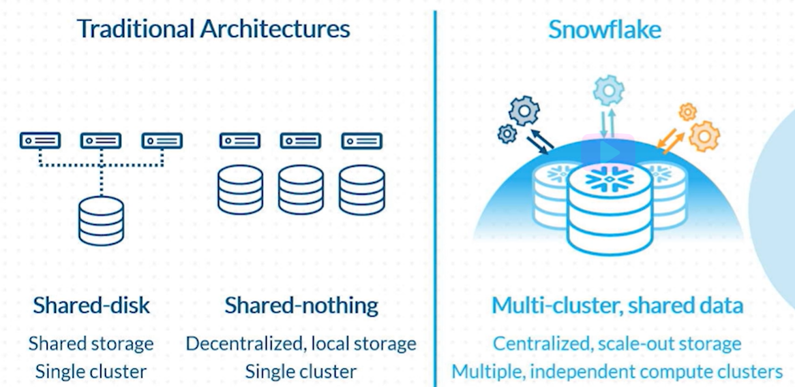
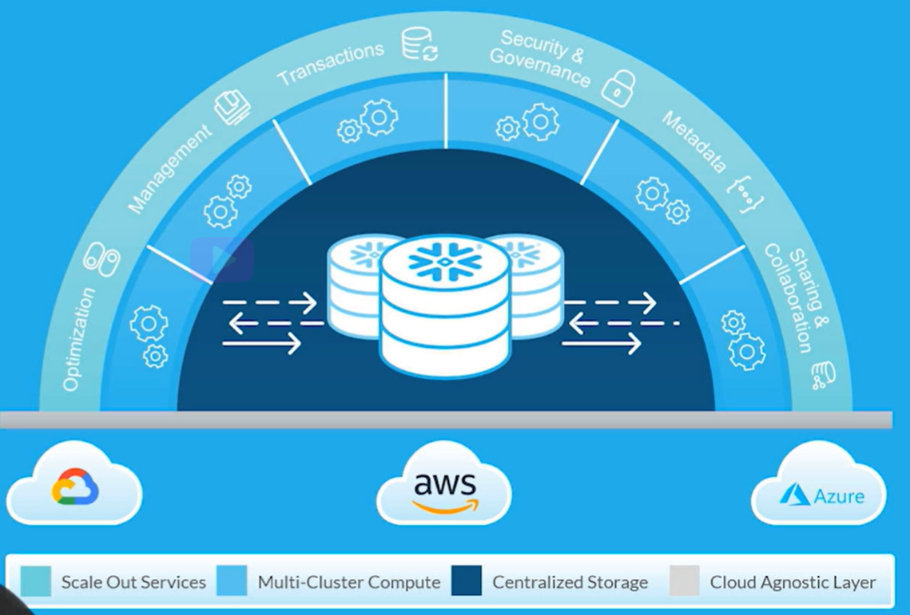
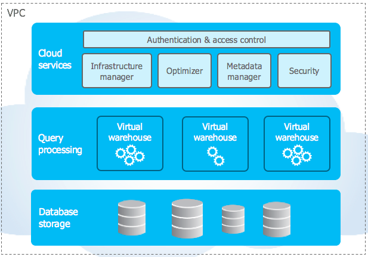

# Architecture of Snowflake

### What is Snowflake?

- Snowflake is a pure **SaaS**(Software AS A Service).
- It is a Data Warehouse that runs on cloud.
- Available on AWS, Azure, GCP.
- Stores data in **_columnar_** format.
- Works well with semi-structured data like **JSON, XML, AVRO, Apache ORC, Parque**t.
- Separate data type for storing semi-structure data i.e. **VARIANT**.

### Traditional Architecture


- **Shared Disk Architecture** uses multiple nodes to access data stored on a single storage system.
- In **Shared Nothing Architecture** all nodes have soul access to distinct storage system.

<br>

_**Traditional Vs Snowflake Architecture**_



- Snowflake is a hybrid of shared disk and shared nothing architecture.
- Like Shared Disk 
    - It has central data repository i.e. accessible to all compute nodes.
    - This provides simplicity like Shared Disk Architecture
<br><br>    
- Like Shard Nothing
    - Each node or VW(Virtual Warehouse) stores data locally.
    - This provides Massive Parallel Processing (MPP), performance, and scalability like Shared Nothing Architecture.

<br>

---

### Layers of Snowflake ###

- Centralized Storage  
- Multi-Cluster Compute  
- Cloud Services  
- Cloud Agnostic Layer



<br>




_**Note :**_ 
- You can run many sqls without the use of an active warehouse because of the **CLoud Service Layer**.

```sql

USE DATABASE db_name;
USE SCHEMA schema_name;

--ALL CONTEXT QUERIES
--EVEN CREATING A TABLE, DB, SCHEMA
--ALSO CHECKING THE METADATA INFO OF A TABLE LIKE COUNT(*), min(colum_name), max(column_name)

```

---
