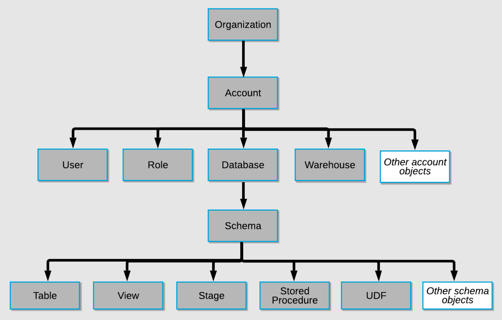

# Snowflake Objects

 

---

### LIST OF SCHEMA OBJECTS IN SNOWFLAKE ###

1. TABLE,
2. EXTERNALTABLE,
3. VIEW,
4. MATERIALIZED VIEW,
5. SEQUENCE,
6. FUNCTION,
7. PROCEDURE,
8. FILEFORMAT,
9. STAGE,
10. PIPE,
11. STREAM,
12. TASK

---
