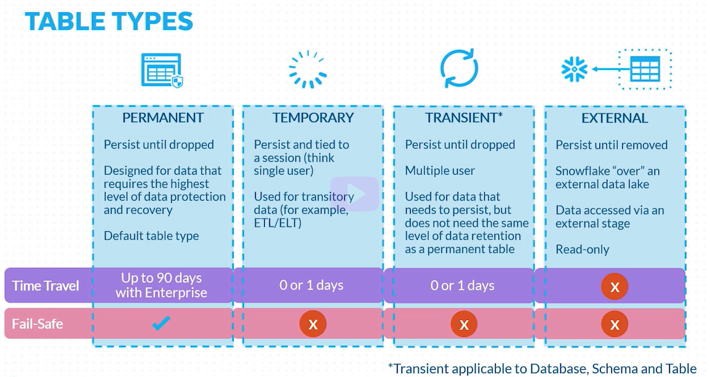
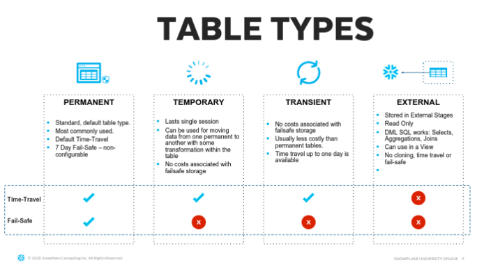

# Types Of Tables In Snowflake



<br>



_**Note :**_

- If the schema is transient then all tables inside that schema will be transient and same for temporary schemas.
- Temporary table with same name as permanent table can be created and will take dominance for that session.(transient table with same name as permanent table cannot be created).
- External tables cannot be cloned
- Only way to clone external table: 
  
```sql

    SELECT
        'CREATE OR REPLACE TABLE ALPHA_POC_DB.EVENT_RAW.' || TABLE_NAME || ' AS SELECT * FROM ALPHA_DEV_DB.EVENT_RAW.'||TABLE_NAME||';' AS stmt
    FROM
        ALPHA_DEV_DB.INFORMATION_SCHEMA."TABLES"
    WHERE
        TABLE_SCHEMA = 'EVENT_RAW'
        AND TABLE_TYPE = 'EXTERNAL TABLE'
        AND TABLE_NAME NOT IN (
        SELECT
            table_name
        FROM
            INFORMATION_SCHEMA."VIEWS");    
        
```
