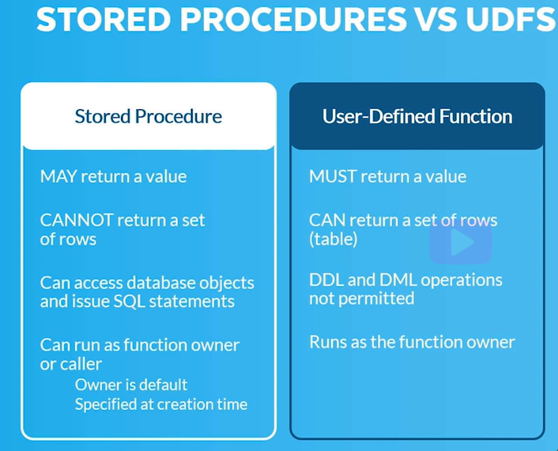

# User Defined Functions (UDF)

- Perform custom operations that are not available through the built-in functions.
- SQL and JavaScript supported.
- **No DDL/DML support**.
- Can be unsecure or secure.
- Return a singular scalar value or, if defined as a table function, a set of rows.

```sql
-- shows all system functions
SHOW FUCNTIONS;

--shows all functions created by user
SHOW USER FUNCTIONS;
```

- Eg of a SQL UDF

```sql
create or replace function simple_table_function() 
returns table (x integer, y integer) 
as
$$
    select 1, 2 
    union all 
    Select 3, 4
$$
;

--Call the udf
select * from table(simple_table_function());

```


- Eg of a Javascript UDF
  
```sql
CREATE OR REPLACE FUNCTION array_sort(A array)
Returns array
LANGUAGE JAVASCRIPT 
AS
$$
return A.sort(); 
$$
;

--Call the UDF with a small array
SELECT ARRAY_SORT(PARSE_JSON('[2,4,1,5,3]'));

--The Output would 100k Similar to :

-- [1,2,3,4,5]

```

---

## Stored Procedures Vs UDF

<br>



_**Note :**_
- In stored Procedure "Execute as Owner is default", "Execute as caller" can be specified at creation time.

- **Execute as Owner**: This means that any role executing this procedure will execute as owner and will have all the rights similar to the owner of the procedure who excuted this.

- **Execute as Caller**: This means that any role executing this procedure will execute as caller role. This means that if the role doesn't have access to underlying object it will give error.


---
