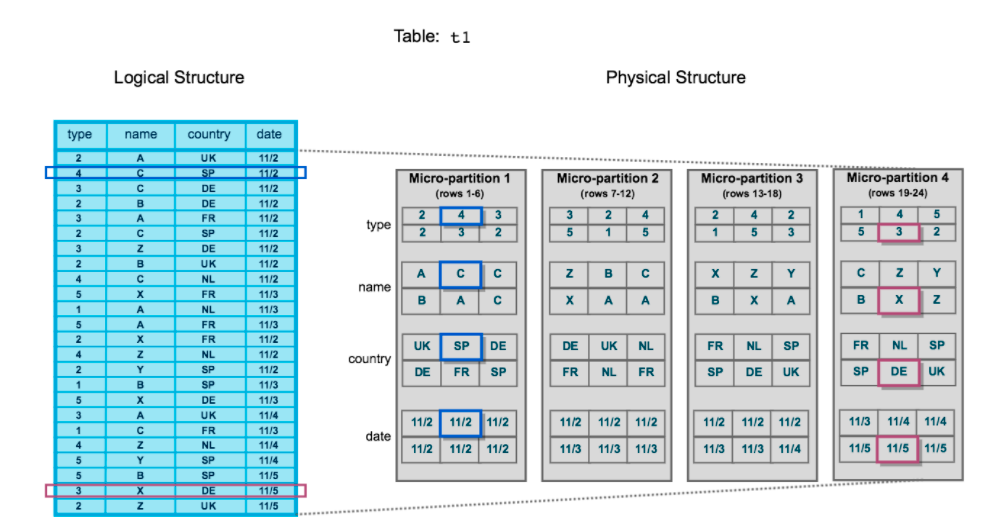
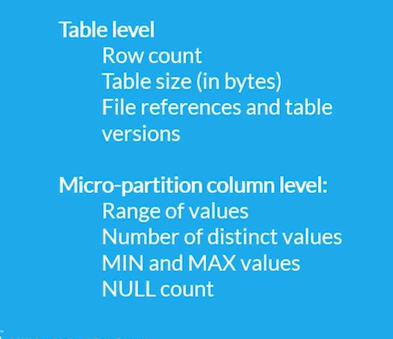

# Micro-partitions & Data Clustering

## What are Micro-partitions?

* Snowflake is columnar-based and horizontally partitioned, meaning a row of data is stored in the same micro-partition. 

* Each block represents a set of rows from the table and is stored in a compressed columnar format.

* All data in Snowflake tables is automatically divided into micro-partitions, which are contiguous units of storage.

* Each micro-partition contains between 50 MB and 500 MB of uncompressed data (Generally max 16MB Compressed).
  
* Micro-Partitions are immutable (Write Once Read Only) - updates create a new micro-partition versions, (Old Version can be used for time travel).

---

## MetaData Info

---

**NOTE:**
> The actual size in Snowflake is smaller because data is always stored compressed.

 

* Groups of rows in tables are mapped into individual micro-partitions, organized in a columnar fashion.

 

**NOTE:**
> Micro-partitioning is automatically performed on all Snowflake tables. Tables are transparently partitioned using the ordering of the data as it is inserted/loaded.

---

 
 

# Data Clustering

## What is Data Clustering?

* Typically, data stored in tables is sorted/ordered along natural dimensions (e.g. date and/or geographic regions). 

* This “clustering” is a key factor in queries because table data that is not sorted or is only partially sorted may impact query performance, particularly on very large tables.

* In Snowflake, as data is inserted/loaded into a table, clustering metadata is collected and recorded for each micro-partition created during the process. 

* Snowflake then leverages this clustering information to avoid unnecessary scanning of micro-partitions during querying, significantly accelerating the performance of queries that reference these columns.

 

## What is Clustering Depth

* The clustering depth for a populated table measures the average depth (1 or greater) of the overlapping micro-partitions for specified columns in a table. 

* The smaller the average depth, the better clustered the table is with regards to the specified columns.

* A table with no micro-partitions (i.e. an unpopulated/empty table) has a clustering depth of 0.

 

## Calculating the Clustering Information & Depth for a Table

       SELECT SYSTEM$CLUSTERING_INFORMATION('ALPHA_ANALYTICS.FACT_EDR_CALCULATED_TMP2','(DIM_EDR_WELL_INFO_KEY)');

       --Clustering Depth
       SELECT SYSTEM$CLUSTERING_DEPTH('ALPHA_ANALYTICS.FACT_EDR_CALCULATED_TMP','(DIM_EDR_WELL_INFO_KEY)');

* For the table having clustered key

       SELECT SYSTEM$CLUSTERING_RATIO('FACT_EDR_CALCULATED_TMP');

 

## What is Clustering Key?

* A clustering key is a subset of columns in a table (or expressions on a table) that are explicitly designated to co-locate the data in the table in the same micro-partitions. 

* Clustering keys are not intended for all tables. 

* The size of a table, as well as the query performance for the table, should dictate whether to define a clustering key for the table.

* In general, tables in the multi-terabyte (TB) range will experience the most bene
fit from clustering, particularly if DML is performed regularly/continually on these tables.

 

## Strategies for Selecting Clustering Keys

*  Snowflake recommends a maximum of 3 or 4 columns (or expressions) per key.

*  Adding more than 3-4 columns tends to increase costs more than benefits.

* Cluster columns that are most actively used in selective filters.

* If there is room for additional cluster keys, then consider columns frequently used in join predicates.

* It is important to choose a clustering key that has:

>1. A large enough number of distinct values to enable effective pruning on the table.
>2. A small enough number of distinct values to allow Snowflake to effectively group rows in the same micro-partitions.

### NOTE:

> 1. A column with very low cardinality  might yield only minimal pruning.
> 2. At the other extreme, a column with very high cardinality is also typically not a good candidate to use as a clustering key directly.

 

## Important Usage Notes:

* If you define two or more columns/expressions as the clustering key for a table, the order has an impact on how the data is clustered in micro-partitions.

* An existing clustering key is copied when a table is created using *CREATE TABLE … CLONE.*

* An existing Clustering key is **not** propagated when a table is created using *CREATE TABLE … LIKE.*

* An existing clustering key is **not** supported when a table is created using *CREATE TABLE … AS SELECT;*

* Defining a clustering key directly on top of VARIANT columns is not supported; however, you can specify a VARIANT column in a clustering key if you provide an expression consisting of the path and the target type.

 

## RECLUSTER

* Reclustering consumes credits and also results in storage costs.

* This process can create significant data turnover because the original micro-partitions are marked as deleted, but retained in the system to enable Time Travel and Fail-safe. 

* The original micro-partitions are purged only after both the Time Travel retention period and the subsequent Fail-safe period have passed.

* This typically results in increased storage costs.

 
 

### RESOURCES: 

https://visualbi.com/blogs/snowflake/micro-partitioning-snowflake/

* This blog tells about how data is inserted and deleted efficiently with the help of partitions.

http://cloudsqale.com/2019/12/02/snowflake-micro-partitions-and-clustering-depth/

* Best explaination.