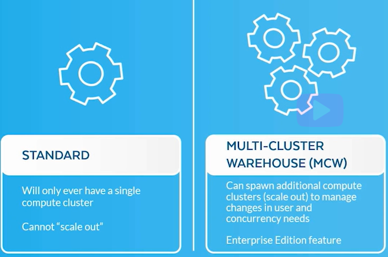
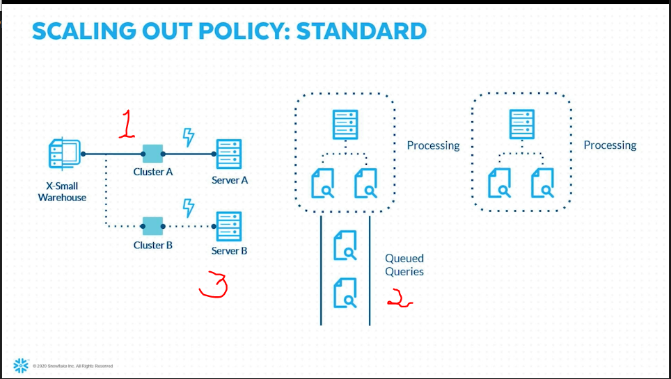
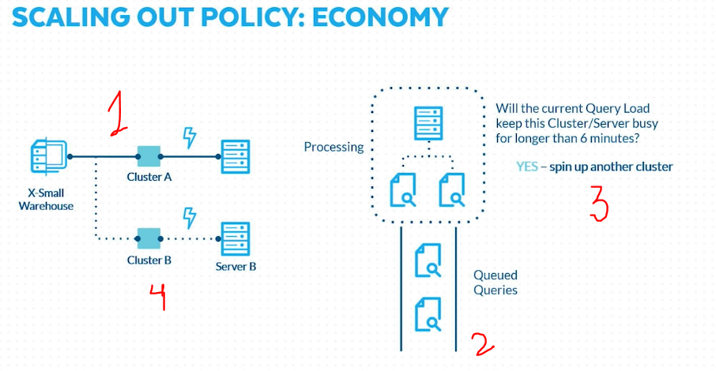
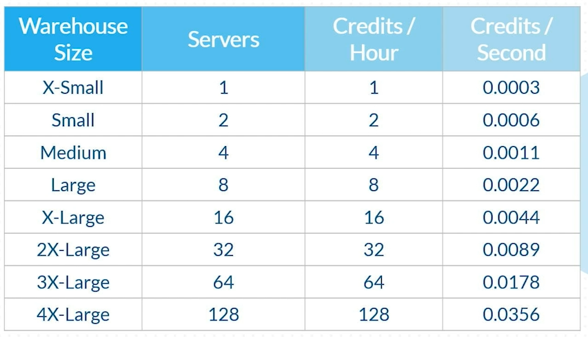
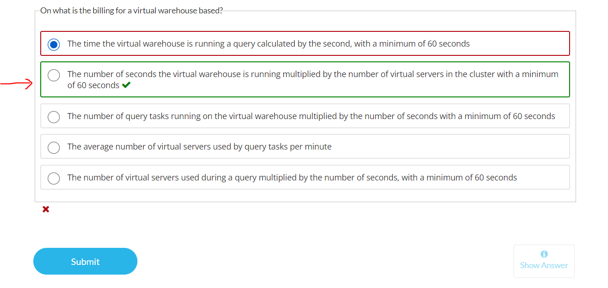
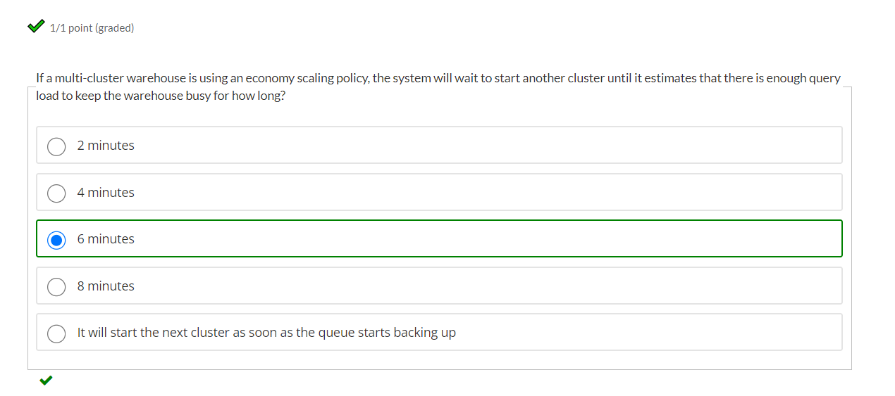

# Virtual Warehouse

## What is Virtual Warehouse?

Virtual Warehouse is the compute power for the Snowflake.

- Warehouse power is used for loading data.
- Warehouse power is used for unloading data.
- Warehouse power is used for querying data.
- While running, a virtual warehouse consumes snowflake credits and you are charged for that compute.

Available Sizes

- X-SMALL
- SMALL
- MEDIUM
- LARGE
- X-LARGE
- 2X-LARGE
- 3X_LARGE
- 4X-LARGE
  
---

## Standard Vs Multi Cluster Warehouse

- Multi-Cluster Warehouse feature is available for **Enterprise** and above editions.
- An Enterprise Edition also gives benefit of SCALING OUT i.e. ELASTIC DATA WAREHOUSING
  in which WH will stretch for extra work and will come back to normal state after the work has been done.

- Multi-Cluster options (Min & Max cluster)
  
  - Eg - Medium Size has 4 servers.
    (min,max) = (1,10) i.e. when min, use 1 cluster with 4 servers and when max, use 10 cluster with 40 servers.

 

- Elastic Data Warehousing has two additional components:

  - SCALE-OUT (_**automated**_) - Scaling a warehouse OUT will increase the number of servers & clusters. (e.g. Min to Max)
  - SCALE-IN (_**automated**_) - Scaling a warehouse IN will decrease the number of clusters. (e.g. Max to Min)

 

- For STANDARD EDITION.
  - SCALE-UP (_**manual**_) - Scaling a warehouse UP will decrease the number of servers. (e.g. Small to Medium)
  - SCALE-DOWN (_**manual**_) - Scaling a warehouse DOWN will decrease the number of servers. (e.g. Medium to Small)

---

 

_**Note :**_

- Resizing the warehouse from eg: (L-XL) doesn't stop the query or give error, instead resize happens on the fly and the queries that were running will keep running on large state but any new query/ queued query will run on extra large state.
  
- In the **WebUI** the default size of the WH is **X-Large**, but using **SQL Command** if you don't specify the size of the warehouse then by default it takes **X-Small**.

- There are two **scaling policy** in Enterprise Edition or Multi-Cluster Warehousing
  1. Standard
  2. Economy

      1.Scale Out: Standard Policy
      

      2.Scale Out: Economy Policy
      

- Auto suspend:
  - Min 5 min using WebUI
  - Min 1 min (60 sec) using SQL
  
- INITIALLY_SUSPENDED = TRUE;  is an option to use in SQL to suspend the WH as soon as it gets created.

 

---

## Virtual Warehouse Credits

---

 

## Cached Memory

- The size of cached is determined by no. of servers in WH.
- The cache is dropped when the WH is suspended.
  - So, when restarted the WH may be slower.
- If your o/p of the query is cached & table is not affected then the result will come from the cached.
  - This can save credit.

---

 

## MCQs

---