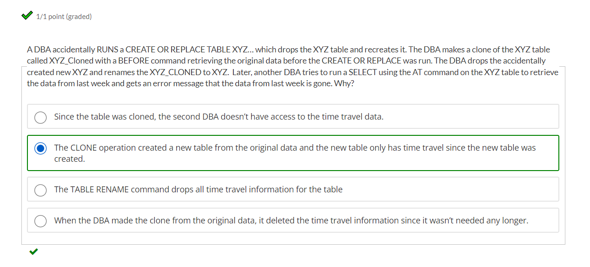

# Clone

- Quickly take a "snapshot" of any table, schema, or database.
  
- When the clone is created: 
    - All micro-partitions in both tables are fully shared.
   - Micro-partition storage is owned by the oldest table, clone references them.
  
- No additional storage costs until changes are made to the original or the clone.


_**Note :**_
- External tables cannot be cloned.
- Internal (Snowflake) stages are not cloned.
- Only way to clone external table: 
  
```sql

    SET dbname = '';
    set schema_name = '';

    SELECT
        'CREATE OR REPLACE TABLE ALPHA_POC_DB.EVENT_RAW.' || TABLE_NAME || ' AS SELECT * FROM ALPHA_DEV_DB.EVENT_RAW.'||TABLE_NAME||';' AS stmt
    FROM
        identifier($dbname).INFORMATION_SCHEMA."TABLES"
    WHERE
        TABLE_SCHEMA = 'EVENT_RAW'
        AND TABLE_TYPE = 'EXTERNAL TABLE'
        AND TABLE_NAME NOT IN (
        SELECT
            table_name
        FROM
            INFORMATION_SCHEMA."VIEWS");    
        
```
---

## MCQ:


