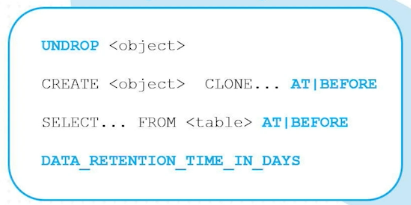

# Time Travel

- Accessing historical data at any point within a defined period.
- Each type of table has time travel period.
- You can undrop a table if it is missing within a time travel period.
- If the file is missing which is not within the time period then you can make use of fail-safe support and contact Snowflake for the same.
- If you delete a row then Clone table from a previous point in time using time travel.


---

## Time Travel SQLs



```sql

-- To check DATA_RETENTION_TIME_IN_DAYS at account level
SHOW PARAMETERS IN ACCOUNT;

-- To check DATA_RETENTION_TIME_IN_DAYS at database level
USE DATABASE <db_name>
SHOW PARAMETERS IN DATABASE;

-- To check DATA_RETENTION_TIME_IN_DAYS at schema level
SHOW PARAMETERS IN schema <schema_name>;
--OR
SHOW PARAMETERS IN schema; --set the context before running

-- To check DATA_RETENTION_TIME_IN_DAYS at table level
SHOW PARAMETERS IN TABLE <table_name>;
--OR
SHOW TABLES; --retention_time column

-- We can set the DATA_RETENTION_TIME_IN_DAYS while creating the table
CREATE TABLE <table_name> (id integer, name string) DATA_RETENTION_TIME_IN_DAYS = 1;

-- To alter the default value of DATA_RETENTION_TIME_IN_DAYS
ALTER TABLE <table_name> SET DATA_RETENTION_TIME_IN_DAYS = 7;

```

- AT | BEFORE clause uses one of the following parameters
  - TIMESTAMP

     ```sql
    SELECT * FROM table_name before (timestamp => '2021-04-16 07:30:47.145'::timestamp);
      ```

  - OFFSET (time difference in seconds from the present time)
  
     ```sql
    SELECT * FROM table_name at (OFFSET => -60*1.5);
      ```

  - STATEMENT (identifier for statement, e.g. query ID)
  
    ```sql
    SELECT * FROM table_name before (statement => '019b9ee5-0500-8473-0043-4d8300073062')
    ```

---

_**Note:**_

- For **Standard edition** time travel is upto **1 day**.

- For **Enterprise or higher edition** time travel is upto **90 days**.

- The **default time travel** period at the account level or any object level is **1 day** in all editions.

---

## Time Travel Cost

```sql
SELECT * FROM SNOWFLAKE.ACCOUNT_USAGE.TABLE_STORAGE_METRICS;

SELECT  ID, 
  TABLE_NAME, 
  TABLE_SCHEMA,
  TABLE_CATALOG,
  ACTIVE_BYTES / (1024*1024*1024) AS STORAGE_USED_GB,
  TIME_TRAVEL_BYTES / (1024*1024*1024) AS TIME_TRAVEL_STORAGE_USED_GB
FROM SNOWFLAKE.ACCOUNT_USAGE.TABLE_STORAGE_METRICS
ORDER BY STORAGE_USED_GB DESC,TIME_TRAVEL_STORAGE_USED_GB DESC;
```

---

## Fail Safe

- Fail safe only works on permanent tables as (transient, temporary, external) tables do not have fail safe.
  
- **7-day retention** for historical data after Time Travel expiration.

- Only accessible by Snowflake Team.

### Fail Safe Cost

```sql
SELECT  ID, 
  TABLE_NAME, 
  TABLE_SCHEMA,
  ACTIVE_BYTES / (1024*1024*1024) AS STORAGE_USED_GB,
  TIME_TRAVEL_BYTES / (1024*1024*1024) AS TIME_TRAVEL_STORAGE_USED_GB,
  FAILSAFE_BYTES / (1024*1024*1024) AS FAILSAFE_STORAGE_USED_GB
FROM SNOWFLAKE.ACCOUNT_USAGE.TABLE_STORAGE_METRICS
ORDER BY FAILSAFE_STORAGE_USED_GB DESC;
```

---
