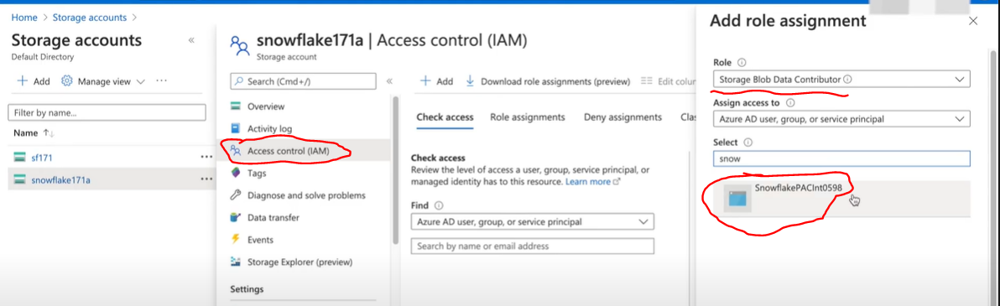
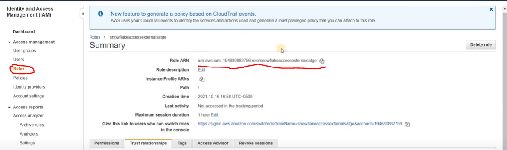
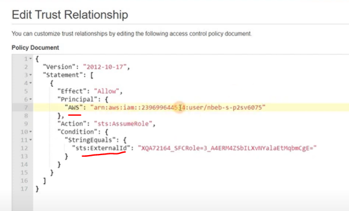

# Storage Integration

- A storage integration is a Snowflake object that stores a generated identity and access management (IAM) entity for your external cloud storage, along with an optional set of allowed or blocked storage locations (Amazon S3, Google Cloud Storage, or Microsoft Azure).

- STORAGE INTEGRATIONS are created by ACCOUNTADMIN role and then he gives grants.

```sql
USE ROLE ACCOUNTADMIN;
GRANT USAGE ON INTEGRATION <name> TO ROLE SYSADMIN;
USE ROLE SYSADMIN;
```

- While creating a stage putting the credentials in the stage is not secure and the best secure way is to use storage integration.

---

## Azure Storage Integration

```sql
CREATE OR REPLACE STORAGE INTEGRATION integration_name
TYPE = EXTERNAL_STAGE
STORAGE_PROVIDER = AZURE
ENABLED = TRUE
AZURE_TENANT_ID = ''
STORAGE_ALLOWED_LOCATION = ('azure://storage-account-name.blob.core.windows.net/mycontainer/path1/', 'azure://storage-account-name.blob.core.windows.net/mycontainer/path2/');

--AZURE_TENANT_ID:
--   Search for _Azure Active Directory_ and in _Tenanat information_ you will get Tenant ID.

```

Event after creating the storage integration, you still cannot access the azure container until you set up the permissions.

```sql
-- Step 1 
DESC STORAGE INTEGRATION integration_name ;

-- Step 2
-- click on the AZURE_CONSENT_URL 
-- Check on Consent on behalf of your organisation
-- ACCEPT the permission.

```

Now, create and IAM role in AZURE:

- Click on Access control (IAM) and add a role assignment.
- select a role _Storage Blob Data Contributor_
- select snowflakePACint in 3rd row and save.



- You can now use the storage integration in a stage.

---

## AWS Storage Integration

```sql
CREATE OR REPLACE STORAGE INTEGRATION integration_name
TYPE = EXTERNAL_STAGE
STORAGE_PROVIDER = s3
ENABLED = TRUE
STORAGE_AWS_ROLE_ARN = ''
STORAGE_ALLOWED_LOCATION = ('s3://mybucket3/path3/', 's3://mybucket4/path4/');

```

- STORAGE_AWS_ROLE_ARN
  
    

- You will get the above arn after creating **IAM** role in AWS.
  
  - Create an IAM role using _Another AWS Account_ option in aws for _'AmazonS3FullAccess'_ permission policy.

  - Using DESC keyword(for storage integration) in snowflake get the IAM_USER_ARN & AWS_EXTERNAL_ID and paste it in trust relationships in AWS.

    

---
