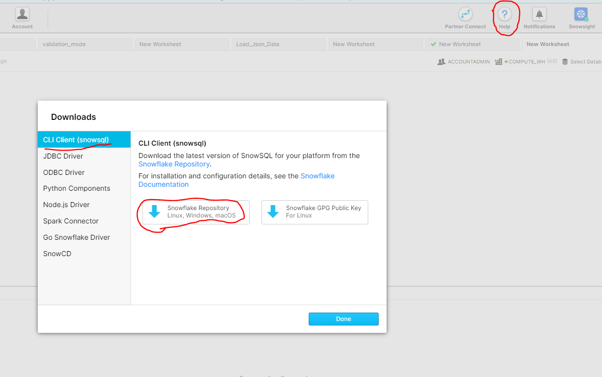

# Data Unloading

- Download the CLI driver by clicking on Help and then Download.
- 
  
- Install the driver.

---

- Resovle Error: Failed to initialize log.

  - Solution:

    - 

    - 

---

 - Create a stage and copy the data into that stage
 - 

---

- Using GET command load the data into local Windows Drive
- 
