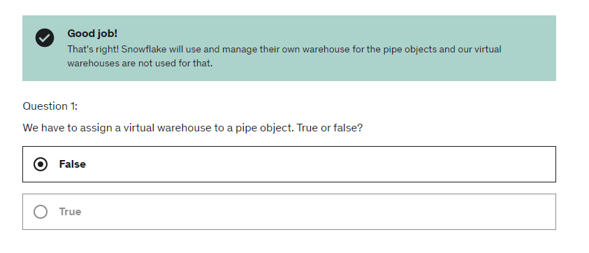
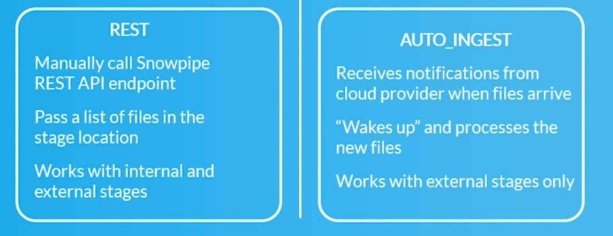

# Snowpipe

- Snowpipe is continous loading option in Snowflake.

- Enables loading once a file appears in a bucket.

- If data needs to be available immediately for analysis.

- Snowpipe uses server-less features instead of warehouses.

    

---

## Steps to create snowpipe

- Create a table.

- Create a file format

- Create a stage with file format

- Create pipe

    ```sql
    create pipe pipe_name 
    auto_ingest = true
    as 
    copy into table_name 
    from @stage;
    ```

- Configue aws notification

  - Go to the properties of the bucket and create an event notification.

  - Specify the prefix(s3 subfolder path) in prefix option and choose "*All Object Create Event*" option in "*Event types*".

  - In Destination option choose SQS Queue and enter the SQS queue ARN(This ARN can be found using running DESC pipe pipe_name and copying the value in notification_channel in snowflake).

---

### REST VS AUTO_INGEST



---

## Error Handling in Snowpipe

```sql
-- Validate pipe is actually working
SELECT SYSTEM$PIPE_STATUS('employee_pipe');
```

```sql
-- Snowpipe error message
SELECT * FROM TABLE(VALIDATE_PIPE_LOAD(
    PIPE_NAME => 'table_name',
    START_TIME => DATEADD(HOUR,-2,CURRENT_TIMESTAMP())));
```

```sql
-- COPY command history from table to see error massage
SELECT * FROM TABLE (INFORMATION_SCHEMA.COPY_HISTORY(
   table_name  =>  'table_name',
   START_TIME =>DATEADD(HOUR,-2,CURRENT_TIMESTAMP())));
```

---

- Pause/start the pipe:

 ```sql
-- Pause pipe
ALTER PIPE pipe_name SET PIPE_EXECUTION_PAUSED = true;

-- Verify pipe is paused and has pendingFileCount 0 
SELECT SYSTEM$PIPE_STATUS('pipe_name');

-- Resume pipe
ALTER PIPE pipe_name SET PIPE_EXECUTION_PAUSED = false;

-- Refresh the pipe
ALTER PIPE pipe_name refresh;
```
