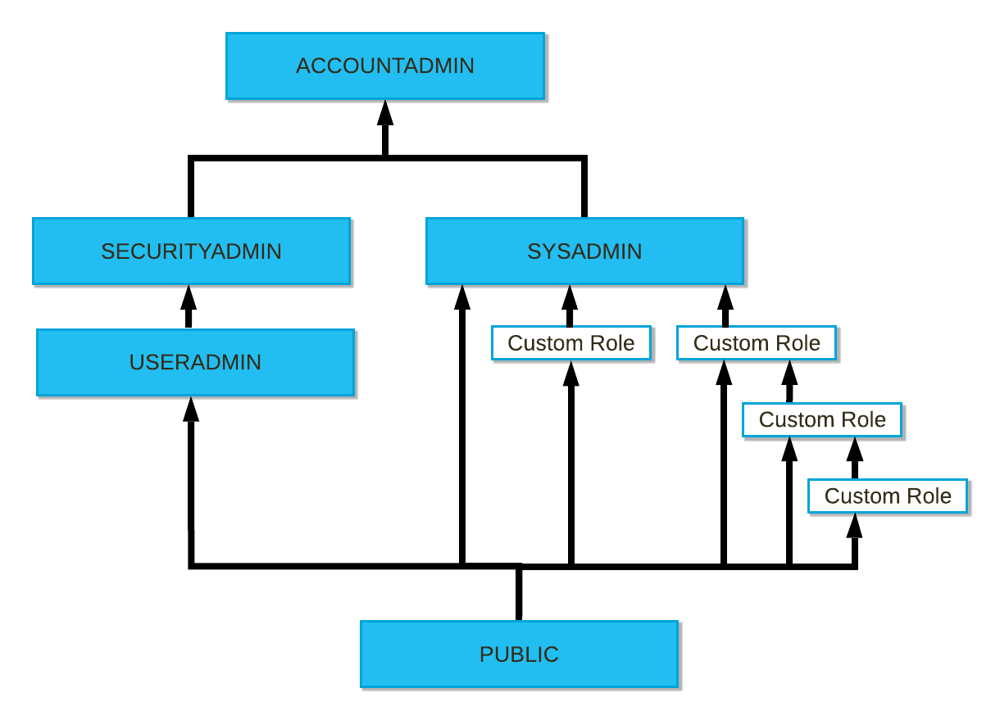

# Access Control

1. ACCOUNTADMIN
- This is the super root user.
- This is the most powerful account level and should be assigned to at-least 2 users.
- Do not use ACCOUNTADMIN to create objects as you will have to then give grants from this a/c & is not recommended.

2. SECURITYADMIN
- It globally manages grants.
- Create users and roles.

3. SYSADMIN
- This is the default role whenever you login.
- Creates all objects like wh, schemas, table, views, etc
- Best Practice to grant all roles to sysadmin.

4. USERADMIN 
- Creates user and manages roles.

5. PUBLIC
- This role is the last role in the hierarchy and anyone can see all the objects that are belonged to this role.

---

## ACCOUNTADMIN VS SECURITYADMIN:

- Both can see Account option.

- ACCOUNTADMIN can create reader account but SECURITYADMIN cannot.

- ACCOUNTADMIN can see USAGE and BILLING related info in Account tab but SECURITYADMIN cannot.

---

