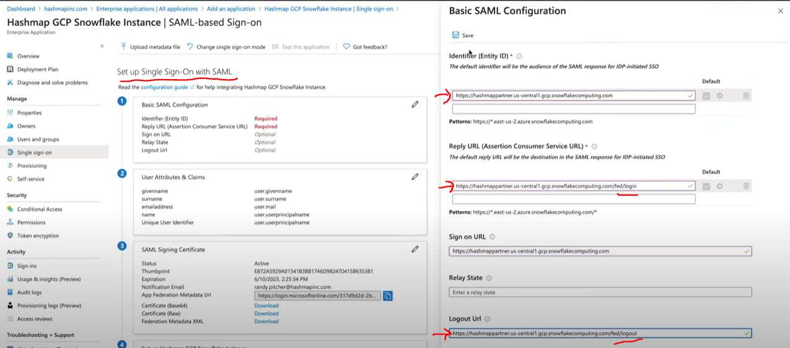

# Authentication


---
<br>

## Azure Single Sign On

- In Azure
  
  - Go to *Azure Active Directory*
  - Add a *new application* i.e *Snowflake* in *Enterise applications*
  - Enter the name of the application
  - Set up a *single signon* and select *SAML*
  - Add *Basic SAML Configuration*
    
  - Download the *Certificate (Base64)* file in *SAML Signing Certificate*, this will have certificate key

- In Snowflake

  - Run the below query ON Snowflake
  
  - ```sql
    USE ROLE ACCOUNTADMIN;

    ALTER ACCOUNT SET 
    SAML_IDENTITY_PROVIDER = `{
        "certificate": "<Paste the content of downloaded certificate from azure portal>",
        "ssoUrl": "<Login URL value from azure>",
        "type": "custom",
        "label": "<AZUREAD>"
    }`;

    // Enable SSO(Single Sign On) button on the login page
    ALTER ACCOUNT SET SSO_LOGIN_PAGE = TRUE;

    ALTER USER USER_NAME SET LOGIN_NAME = '<your azure mail id>';

    ALTER USER USER_NAME UNSET PASSWORD;
    ```


---

**Resources:**

Azure Single Sign On: <https://www.youtube.com/watch?v=eHP-CoLM4FE>

Azure Official Link: https://docs.microsoft.com/en-us/azure/active-directory/saas-apps/snowflake-tutorial
