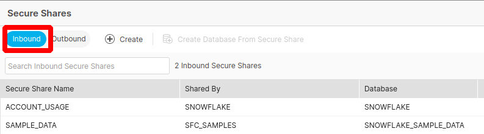
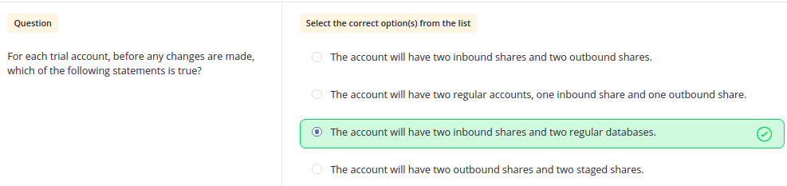
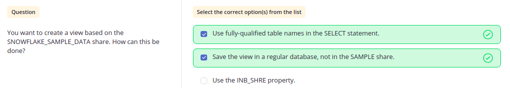
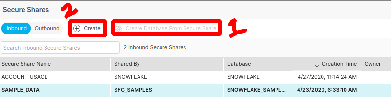
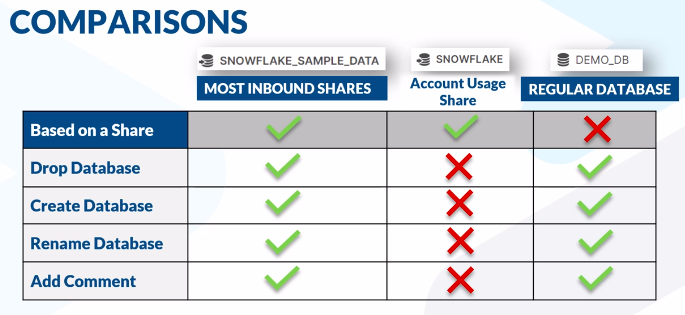
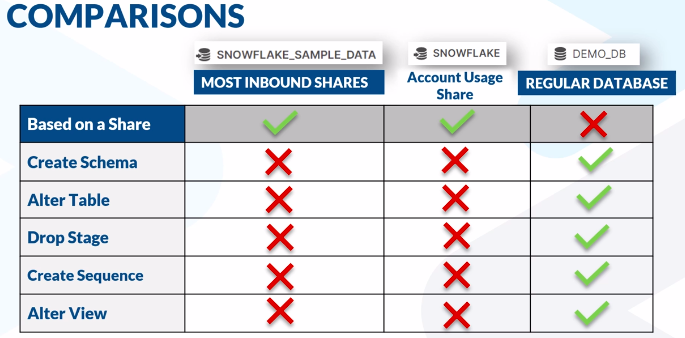
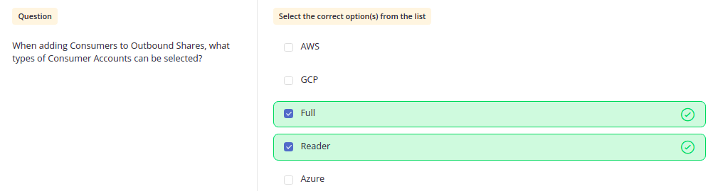
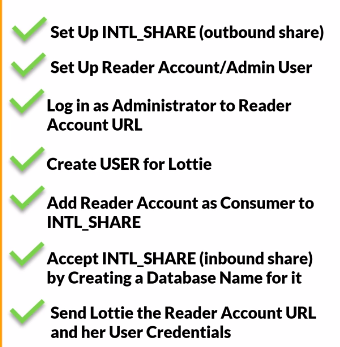
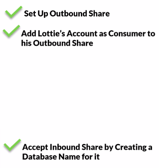
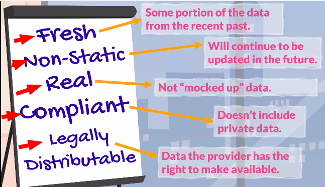

# Questions based on Data Sharing

 

Q. Default Databases & Inbounds available.

    //For SYSADMIN

    DEMO_DB
    UTIL_DB
    SNOWFLAKE_SAMPLE_DATA

    //For ACCOUNTADMIN

    DEMO_DB
    UTIL_DB
    SNOWFLAKE_SAMPLE_DATA
    SNOWFLAKE

`Two Default Inbound Shares with ACCOUNTADMIN (SHARE area option is only accessible using ACCOUNTADMIN)
`

    ● These two default inbound shares database are only read-only databases.

`MCQ`

    ● Two Inbound Shares: Snowflake (ACCOUNT_USAGE) & SNOWFLAKE_SAMPLE_DATA(SAMPLE_DATA)
    ● Two Regular Databases: UTIL_DB & DEMO_DB

`MCQ`

---
 

Q. Creating INBOUND & OUTBOUND share

`Using WebUI`

`● Here, 1 will create an INBOUND share and 2 will always create an OUTBOUND share`

 

`Using Query`
    
    --1. Inbound share

    CREATE DATABASE "THAT_COOL_SAMPLE_STUFF" 
    FROM SHARE SFC_SAMPLES."SAMPLE_DATA";

    --Granting IMPORT priviliges (Inbound & Outbound share can only be given import priviliges)
    --ALl Inbound shares are only read-only

    GRANT IMPORTED PRIVILEGES ON DATABASE "THAT_COOL_SAMPLE_STUFF" TO ROLE "SYSADMIN";

`You cannot change the data of any Inbound Share as they are read-only`

 

    --2. Outbound Share

    CREATE SHARE "INTL_SHARE" COMMENT='';
    GRANT USAGE ON DATABASE "INTL_DB" TO SHARE "INTL_SHARE";
    GRANT USAGE ON SCHEMA "INTL_DB"."PUBLIC" TO SHARE "INTL_SHARE";
    GRANT SELECT ON VIEW "INTL_DB"."PUBLIC"."COUNTRY_CODE_TO_CURRENCY_CODE" TO SHARE "INTL_SHARE";
    GRANT SELECT ON VIEW "INTL_DB"."PUBLIC"."CURRENCIES" TO SHARE "INTL_SHARE";
    GRANT SELECT ON VIEW "INTL_DB"."PUBLIC"."INT_STDS_ORG_3661" TO SHARE "INTL_SHARE";
    GRANT SELECT ON VIEW "INTL_DB"."PUBLIC"."SIMPLE_CURRENCY" TO SHARE "INTL_SHARE";

---
 

Q. How to create secure view from regular views and vice versa ?

    -- Regular to Secure Views

    ALTER VIEW "INTL_DB"."PUBLIC"."NATIONS_SAMPLE_PLUS_ISO"
    SET SECURE;
    
    ALTER VIEW "INTL_DB"."PUBLIC"."SIMPLE_CURRENCY"
    SET SECURE;

    -- Secure to Regular Views
    
    ALTER VIEW "INTL_DB"."PUBLIC"."NATIONS_SAMPLE_PLUS_ISO"
    UNSET SECURE;

    ALTER VIEW "INTL_DB"."PUBLIC"."SIMPLE_CURRENCY"
    UNSET SECURE;

---
 

Q. What types Of Consumer in Outbound Share are there?

`MCQ`

---
 

Q. What are the steps to create a **Reader Account** and share Outbound Database?

---
 

Q. What are the steps to create a **Full Snowflake Account** and share Outbound Database?

---
 

Q. Some Imp Facts about sharing data using Reader and Full account type.

    ● Shares take place between Data Providers & Data Consumers.
    ● Consumers can be Full Account or Reader Account.
    ● Data is always up-to date with Outbound Data Share.
    ● Reader Account Queries can be limited by the Provider Account because
      Provider pays for the query
    ● Reader Account require more set up & Maintenance work by Providers.
    ● Providers pay to store data in both Reader and Full Account.
    ● Provider pay for Consumers query in Reader account whereas
      Consumer pays for querying the data in Full Account.

---
 

Q. What accounts have **DataMarketplace** option in ribbon available?

    ● DataMarketplace only works for AWS Azure accounts.
    ● DataMarketplace option is not available for GCP(Google Cloud Platform) accounts.

---
 

Q. How to extract month from a column?

    --let column be column1
    SELECT MONTH(column1) from table where MONTH(column1) = 1;      --1 is January
    
    --OR
    DATE_PART(MONTH, "column1")
    DATE_PART(year,"column1")
    DATE_PART(week,"column1")
    DATE_PART(day,"column1")

    --extract 60 days from current date
    SELECT DATEADD(day, -60, CURRENT_DATE());               --returns date 2021-03-18 on 2021-05-17

    

 ---
 

Q. How many types of listing for Snowflake Data Marketplace?

    ● There are two types of lisitng:
        1. Standard
        2. Personalized

    ● To Get Data from Standard listing make sure your role is AccountAdmin.
    

 ---
 

Q. What are the criteria for listing data on the Data Marketplace?

 ---
 

Q. How can Data be Shared using Snowflake?

    -Data can be share by following ways

        ● Direct Data Sharing - Creating Outbound Share and adding Consumers to it.(Consumers will get it as Inbound Share)
        ● Data Marketplace - Creating Outbound Share without adding Consumers and lisitng it on Data Marketplace.
                             Consumers can go to Data Marketplace & click on GET DATA and it will be shared with them as Inboud Share.
        ● Data Exchange