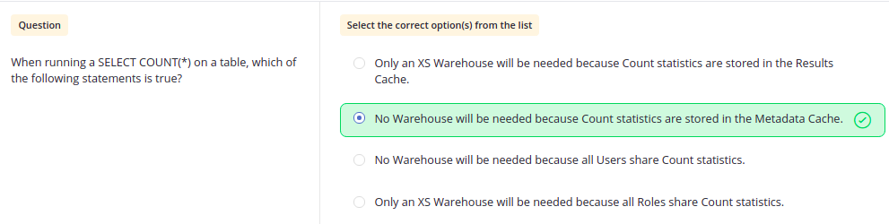
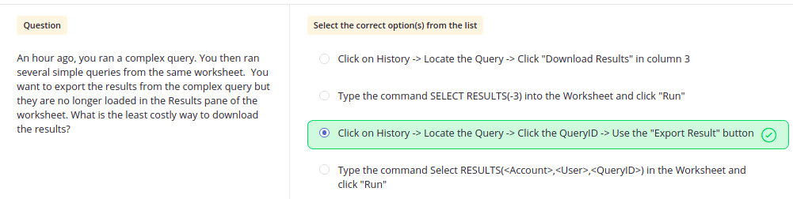
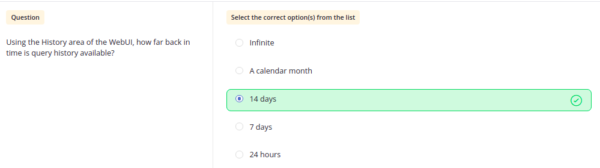
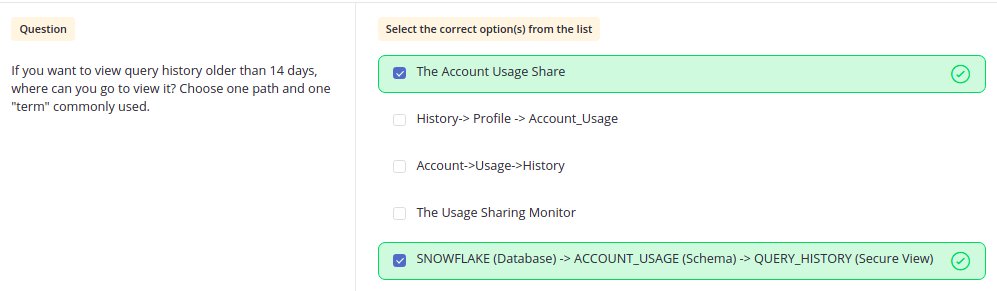
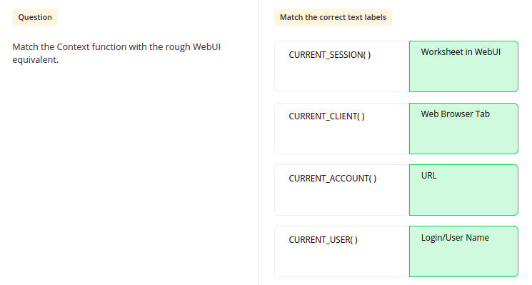
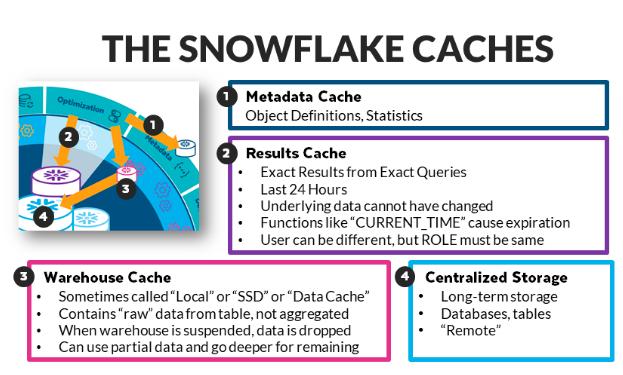
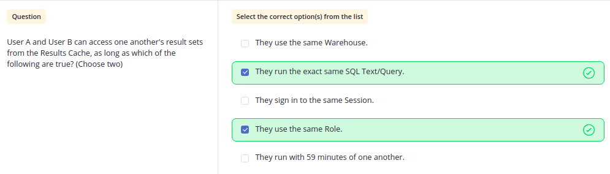
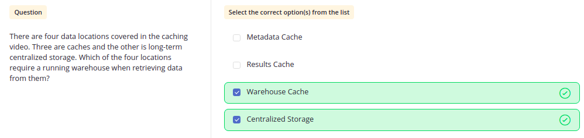

# Questions Based On Level Up Performance

Q. When does WH is not required?

- Create table doesn't require WH
- Select count(*) doesn't require WH as the o/p comes from Metadata Cache.

  
- Below case will not use WH but is valid for only 24 hours as result comes from Result Cache

---
 

Q. History area in WebUI

- For History prior to 14 days:

---
 

Q. Meaning of different contexts.

---
 

Q. Snowflake CACHES

    It has 3 caches
        1. Metadata Cache
        2. Result Cache
        3. Warehouse Cache

